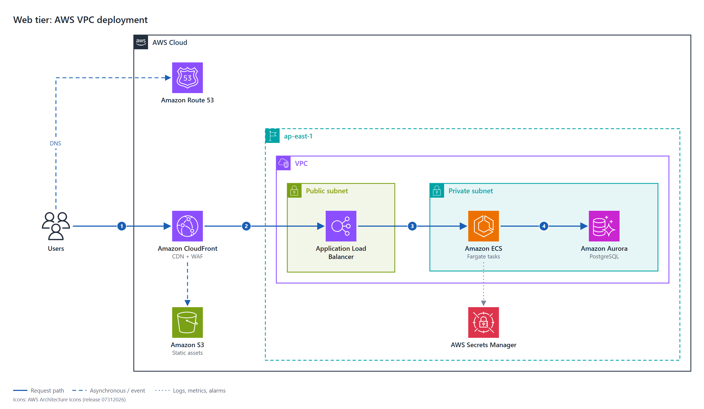

# tech-design-doc

An agent skill that writes technical design documents with diagrams that are checked before delivery.

Works with **Claude Code**, **GitHub Copilot** and **OpenAI Codex**.



## What it does

Ask your agent for a design doc, an architecture diagram or a cloud deployment diagram. The skill:

- **Writes the doc in Markdown** (Confluence-ready), as an **HTML** page, or both. The doc leads with the decision.
- **Picks one diagram type per question**: system context, sequence, state, data model, deployment.
- **Draws cloud deployment diagrams with the official vendor icons** for AWS, Azure, Microsoft Entra, Power Platform and Google Cloud. One JSON spec gives SVG, PNG, an editable draw.io file, a Mermaid twin and the Markdown snippet.
- **Checks every diagram in headless Chrome** for overlaps, cramped labels and cut-off marks. It delivers nothing until the check prints `0 FAIL`.

## Requirements

| Tool | Needed for |
|---|---|
| Python 3.10+ (standard library only) | every script |
| Chrome, Chromium or Edge | the diagram check and the PNG output (set `CHROME=<path>` if the scripts cannot find it) |
| Node.js | the HTML kit and its screenshots |
| `pymupdf` (optional) | PDF output only |

## Install

### Option 1: Claude Code plugin

```bash
claude plugin marketplace add whitewhiteqq/tech-design-doc
claude plugin install tech-design-doc@tech-design-doc
```

### Option 2: `npx skills add`

```bash
npx skills add whitewhiteqq/tech-design-doc        # into the current project
npx skills add whitewhiteqq/tech-design-doc -g     # globally
```

### Option 3: Manual copy

```bash
git clone https://github.com/whitewhiteqq/tech-design-doc.git
cp -r tech-design-doc/skills/tech-design-doc ~/.claude/skills/      # Claude Code
cp -r tech-design-doc/skills/tech-design-doc .github/skills/        # GitHub Copilot
```

## Add the cloud icon packs (one time)

The repository does not ship the vendor icon packs. Their terms permit the icons in diagrams, not redistribution.

1. Download each pack you need from the table in [`vendor-icons/README.md`](skills/tech-design-doc/vendor-icons/README.md).
2. Save it in the installed skill's `vendor-icons/` folder, under the file name in that table (for example `aws-icons.zip`).
3. Run `python scripts/icons.py rebuild` from the skill folder. It prints the number of icons it found.

Without packs, everything works except cloud deployment diagrams and the `services` figure of the HTML kit. The scripts say so when you need a pack.

## Use

Ask the agent in plain words:

```text
Write a design doc for moving our order service to SQS, Markdown for Confluence.
Draw the AWS deployment diagram for this repo.
Rewrite docs/payments.md as a design doc and add an HTML version.
```

The skill asks one question when the output format is unclear: Markdown, HTML or both.

## Examples

- [`examples/deployment/`](skills/tech-design-doc/examples/deployment/): four deployment diagrams (AWS VPC web app, AWS distributed transaction, Azure web app, Google Cloud event pipeline), each with its JSON spec.
- [`examples/relay-design.html`](skills/tech-design-doc/examples/relay-design.html): a finished HTML design page.

## Repository layout

```
tech-design-doc/
├── .claude-plugin/              # Claude Code plugin and marketplace manifests
└── skills/tech-design-doc/
    ├── SKILL.md                 # The skill: what the agent reads first
    ├── reference/               # Doc skeletons, diagram types, cloud diagram spec, fixes
    ├── scripts/                 # icons.py, cloud_diagram.py, check_diagrams.py
    ├── kit/                     # HTML page kit: shells, figure templates, build.py
    ├── examples/                # Finished diagrams and one finished HTML page
    ├── vendor-icons/            # README with download links and terms; the zips stay local
    └── vendor-js/               # Mermaid browser bundle (MIT) for the offline check
```

## Contributing

See [CONTRIBUTING.md](CONTRIBUTING.md).

## License

Apache-2.0. See [LICENSE](LICENSE).

Third-party content:

- `vendor-js/mermaid.min.js`: Mermaid, MIT licence ([`MERMAID-LICENSE.txt`](skills/tech-design-doc/vendor-js/MERMAID-LICENSE.txt)).
- The example diagrams contain AWS, Microsoft and Google Cloud icons, used under each vendor's terms for architecture diagrams. Those icons are not under Apache-2.0. Each diagram carries the vendor's credit line. See [`vendor-icons/README.md`](skills/tech-design-doc/vendor-icons/README.md) for the exact terms.
- AWS, Azure, Microsoft Entra, Power Platform and Google Cloud are trademarks of their owners. This project has no affiliation with them.
